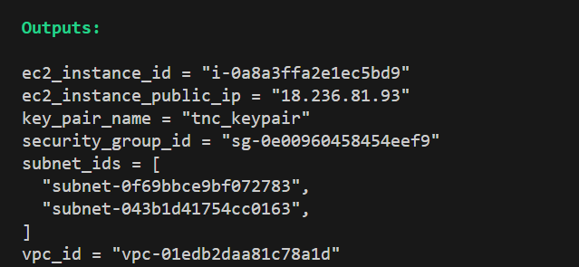

# Terraform Exercise for The Nature Conservancy

## Overview

This project demonstrates how to use Terraform to set up a simple AWS infrastructure. The goal is to create a VPC, two subnets, and an EC2 instance running an Apache web server. The EC2 instance will serve a static HTML page that displays "Hello, TNC!" and allow SSH access from a specific IP address.

## Resources Created

1. **VPC**: A Virtual Private Cloud (VPC) in the Oregon region with a non-default CIDR block.
2. **Subnets**: Two subnets in different availability zones within the VPC.
3. **Security Group**: Configured to allow HTTP traffic on port 80 from anywhere and SSH traffic on port 22 from a specified IP address.
4. **EC2 Instance**: A t3.micro instance running the latest version of Ubuntu with Apache installed, serving a static HTML page.
5. **Key Pair**: A key pair for SSH access, securely stored in AWS Secrets Manager.

## Outputs

After deploying the infrastructure, the following outputs are provided:

- **VPC ID**: The ID of the created VPC.
- **Subnet IDs**: The IDs of the created subnets.
- **Security Group ID**: The ID of the created security group.
- **EC2 Instance ID**: The ID of the created EC2 instance.
- **EC2 Instance Public IP**: The public IP address of the EC2 instance.
- **Key Pair Name**: The name of the key pair used for SSH access.

### Outputs Screenshot

## Project Structure

The project is organized into multiple modules for better maintainability:

- **Root Module**: Contains the main Terraform configuration that ties all modules together.
- **VPC Module**: Manages the creation of the VPC.
- **Subnets Module**: Handles the creation of subnets within the VPC.
- **Security Group Module**: Configures the security group for the EC2 instance.
- **EC2 Module**: Manages the creation of the EC2 instance and key pair.

